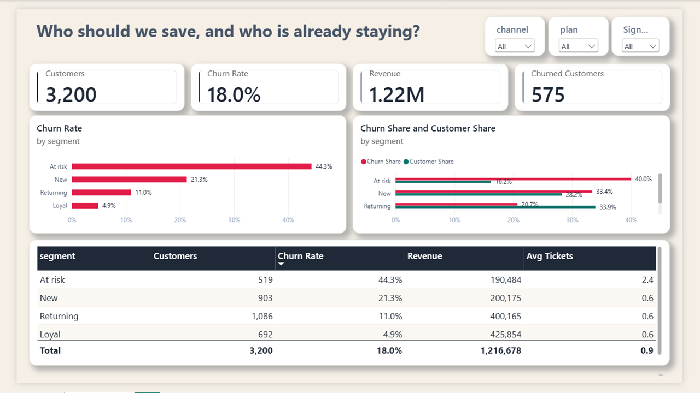

# Who should we save, and who is already staying?

**Customer retention analysis in Power BI, by Mohammed Amine Goumri**



Call At risk customers with 2 or more tickets. That is the save list. Do not discount Loyal. They are 35% of revenue and 4.9% churn. Cut Paid prospecting until the first months are fixed. Referral churns at 11%.

Data is synthetic, 3,200 customers, signups Jul 2024–Jun 2025. Not a client file. This file cannot tell voluntary churn from failed payment.

## The question

A retention team has one month and a limited save budget. Who should they call, and who would stay anyway?

## Data

`data/customers.csv` has 3,200 synthetic subscription customers who signed up between Jul 2024 and Jun 2025. Each row has a segment, plan, acquisition channel, tenure, discount, support tickets, revenue and a churned flag (1 or 0). It is a synthetic file, labeled as such, and not client data.

## What was built

**Load and types.** The CSV was loaded through Text/CSV. `signup_month` is a Date, `discount` and `revenue` are Decimal Numbers, and `tenure_months`, `support_tickets` and `churned` are Whole Numbers.

**DAX measures**, kept in a hidden `_Measures` table so a measure like Revenue doesn't clash with the `revenue` column:

```DAX
Customers         = DISTINCTCOUNT(customers[customer_id])
Churned Customers = SUM(customers[churned])
Churn Rate        = DIVIDE([Churned Customers], [Customers])
Revenue           = SUM(customers[revenue])
Avg Tickets       = AVERAGE(customers[support_tickets])
Revenue Share     = DIVIDE([Revenue], CALCULATE([Revenue], ALL(customers[segment])))
Customer Share    = DIVIDE([Customers], CALCULATE([Customers], ALL(customers[segment])))
Churn Share       = DIVIDE([Churned Customers], CALCULATE([Churned Customers], ALL(customers[segment])))
```

The page also uses one calculated column, `Signup Year = YEAR(customers[signup_month])`.

**The "Who to save" page** has:
- Four cards: Customers, Churn Rate, Revenue and Churned Customers.
- A bar chart of Churn Rate by segment.
- A clustered bar chart of Churn Share vs Customer Share by segment. At risk is a small share of customers but a large share of churn.
- A table of segment, Customers, Churn Rate, Revenue and Avg Tickets, sorted by churn rate with At risk first.
- Slicers for channel, plan and Signup Year.

**Design.** The page uses a custom light theme, `powerbi/churn-save-light.json`: a warm off-white page, white rounded cards with soft shadows, coral for churn and teal for customers who stay.

## Validation

| Segment | Customers | Churn rate | Revenue share | Avg tickets |
|---|---:|---:|---:|---:|
| At risk | 519 | 44.3% | 16% | 2.4 |
| New | 903 | 21.3% | 16% | 0.6 |
| Returning | 1,086 | 11.0% | 33% | 0.6 |
| Loyal | 692 | 4.9% | 35% | 0.6 |
| **Total** | **3,200** | **18.0%** | **100%** | **0.9** |

Total revenue is 1,216,678, and 575 customers churned. At risk is 16% of customers but 40% of churned customers. On the page, filtering the channel slicer to Paid shows 21.8% churn, and Referral shows 10.7%. New's revenue share is 16.45%, so it shows as 16%.

## Recommendations

1. Call At risk customers with 2 or more support tickets this month. That is the save list.
2. Do not discount Loyal. They are 35% of revenue and churn at 4.9%, so they already stay.
3. Cut Paid prospecting until churn in the first months is fixed. Fund Referral, which churns at 11%.

## Caveats

- The file cannot tell voluntary churn from failed payment.
- It doesn't show whether a discount came before the churn or was a save offer after it.
- If Paid is credited last-click, it may be blamed for customers who were already weak.

## Repo layout

```
README.md
screenshot.png
data/customers.csv
powerbi/churn-save-light.json
```

## Credits

Analysis, data model, DAX measures, dashboard design and recommendations by **Mohammed Amine Goumri**.

© 2026 Mohammed Amine Goumri.
